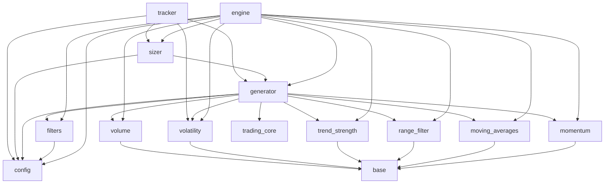

# Project Context

> **Auto-generated by [code-mapper](https://github.com/your-org/code-mapper).**  
> Read this file instead of scanning source files — it captures the full structure at a fraction of the token cost.
> `trend_following` · 22 files (python×22) · 32 classes · 25 functions · ~3,775 source lines

---
## File Structure

```
trend_following/
└── __init__.py
├── backtest/
  └── __init__.py
  └── engine.py
└── cli.py
└── config.py
├── indicators/
  └── __init__.py
  └── base.py
  └── momentum.py
  └── moving_averages.py
  └── range_filter.py
  └── trend_strength.py
  └── volatility.py
  └── volume.py
├── paper_trading/
  └── __init__.py
  └── db.py
  └── tracker.py
├── position_sizing/
  └── __init__.py
  └── sizer.py
└── run_backtest.py
├── signals/
  └── __init__.py
  └── filters.py
  └── generator.py
```

## Class Diagram

```mermaid
classDiagram
    class ADX["ADX"] {
        +name()
        +compute()
        +signal_series()
        +is_trending()
        +latest_value()
        +__init__()
    }
    Indicator <|-- ADX : extends
    class ADXConfig["«dataclass» ADXConfig"] {
        +enabled: bool
        +period: int
        +min_adx: float
    }
    class ATR["ATR"] {
        +name()
        +compute()
        +signal_series()
        +latest_atr()
        +stop_price()
        +atr_series()
        +__init__()
    }
    Indicator <|-- ATR : extends
    class ATRStopConfig["«dataclass» ATRStopConfig"] {
        +enabled: bool
        +period: int
        +multiplier: float
        +trail: bool
    }
    class BacktestConfig["«dataclass» BacktestConfig"] {
        +initial_capital: float
        +commission_per_trade: float
        +commission_pct: float
        +slippage: float
    }
    class BacktestResult["«dataclass» BacktestResult"] {
        +ticker: str
        +equity_curve: Series
        +trades_df: DataFrame
        +metrics: Dict
    }
    class BacktestSummary["«dataclass» BacktestSummary"] {
        +results: Dict
        +portfolio_equity: Optional
        +portfolio_metrics: Optional
    }
    class CrossoverSignal["CrossoverSignal"] {
        +name()
        +compute()
        +signal_series()
        +get_ma_dataframe()
        +__init__()
    }
    Indicator <|-- CrossoverSignal : extends
    class EMA["EMA"] {
        +name()
        +compute()
        +__init__()
    }
    Indicator <|-- EMA : extends
    class Indicator["«abstract» Indicator"] {
        +compute()
        +signal_series()
        +name()
    }
    class IndicatorConfig["«dataclass» IndicatorConfig"] {
        +fast_period: int
        +slow_period: int
        +ma_type: Literal
    }
    class IndicatorResult["«dataclass» IndicatorResult"] {
        +values: Series
        +raw: Optional
        +name: str
    }
    class MACD["MACD"] {
        +name()
        +compute()
        +signal_series()
        +histogram_confirms_buy()
        +histogram_confirms_sell()
        +check_bearish_divergence()
        +bearish_divergence_series()
        ...
    }
    Indicator <|-- MACD : extends
    class MACDConfig["«dataclass» MACDConfig"] {
        +enabled: bool
        +fast: int
        +slow: int
        +signal: int
    }
    class MVWAP["MVWAP"] {
        +name()
        +compute()
        +__init__()
    }
    Indicator <|-- MVWAP : extends
    class MultiTimeframeConfig["«dataclass» MultiTimeframeConfig"] {
        +enabled: bool
        +fast_weeks: int
        +slow_weeks: int
    }
    class MultiTimeframeConfirmation["MultiTimeframeConfirmation"] {
        +name()
        +compute()
        +signal_series()
        +weekly_trend()
        +__init__()
    }
    Indicator <|-- MultiTimeframeConfirmation : extends
    class PortfolioConstraintsConfig["«dataclass» PortfolioConstraintsConfig"] {
        +max_open_positions: int
        +max_sector_exposure_pct: float
        +max_gross_exposure_pct: float
        +adv_participation_pct: float
    }
    class PositionSizingConfig["«dataclass» PositionSizingConfig"] {
        +base_position_pct: float
        +max_position_pct: float
        +sentiment_agree_mult: float
        +sentiment_neutral_mult: float
    }
    class RSI["RSI"] {
        +name()
        +compute()
        +signal_series()
        +is_overbought()
        +is_oversold()
        +latest_value()
        +__init__()
    }
    Indicator <|-- RSI : extends
    class RSIConfig["«dataclass» RSIConfig"] {
        +enabled: bool
        +period: int
        +overbought: float
        +oversold: float
    }
    class RangeFilter["RangeFilter"] {
        +name()
        +compute()
        +signal_series()
        +is_overextended()
        +latest_position()
        +__init__()
    }
    Indicator <|-- RangeFilter : extends
    class RangeFilterConfig["«dataclass» RangeFilterConfig"] {
        +enabled: bool
        +lookback_days: int
        +top_block_pct: float
    }
    class SMA["SMA"] {
        +name()
        +compute()
        +__init__()
    }
    Indicator <|-- SMA : extends
    class ShortConfig["«dataclass» ShortConfig"] {
        +enabled: bool
        +rsi_oversold_required: bool
        +adx_filter: bool
    }
    class Signal["«dataclass» Signal"] {
        +ticker: str
        +date: str
        +action: Action
        +trend_direction: float
    }
    class SignalConfig["«dataclass» SignalConfig"] {
        +sentiment_filter_enabled: bool
        +min_sentiment_confidence: float
        +block_on_negative_sentiment: bool
        +risk_filter_enabled: bool
    }
    class TrendFollowingConfig["«dataclass» TrendFollowingConfig"] {
        +indicator: IndicatorConfig
        +ticker_indicator_overrides: Dict
        +signal: SignalConfig
        +position_sizing: PositionSizingConfig
        +get_indicator_cfg()
    }
    class VolatilityRegime["VolatilityRegime"] {
        +name()
        +compute()
        +signal_series()
        +latest_multiplier()
        +latest_vol()
        +__init__()
    }
    Indicator <|-- VolatilityRegime : extends
    class VolatilityRegimeConfig["«dataclass» VolatilityRegimeConfig"] {
        +enabled: bool
        +period: int
        +low_vol_threshold: float
        +high_vol_threshold: float
    }
    class VolumeConfig["«dataclass» VolumeConfig"] {
        +enabled: bool
        +period: int
        +min_ratio: float
    }
    class VolumeConfirmation["VolumeConfirmation"] {
        +name()
        +compute()
        +signal_series()
        +is_confirmed()
        +latest_ratio()
        +__init__()
    }
    Indicator <|-- VolumeConfirmation : extends
```



## Module Dependencies



## Symbol Index


**`backtest\engine.py`** `python`
> Core backtest engine for the Trend Following strategy.
- `«dataclass» class BacktestResult`  — Per-ticker backtest output.
- `«dataclass» class BacktestSummary`  — Aggregated backtest output across all tickers.
- `def run_backtest(cfg: TrendFollowingConfig, ticker_ohlc: Dict, benchmark_ohlc: Dict, rf_annual: float) → BacktestSummary`  — Run the trend-following backtest across all tickers.
- `def run_portfolio_backtest(cfg: TrendFollowingConfig, ticker_ohlc: Dict, benchmark_ohlc: Dict, rf_annual: float) → BacktestSummary`  — Multi-ticker portfolio backtest with portfolio-level constraints.

**`cli.py`** `python`
> Command-line interface for the Trend Following strategy.
- `def cmd_signals(args) → None`  — Print current BUY/SELL/HOLD signals for all (or one) ticker.
- `def cmd_backtest(args) → None`  — Run a full historical backtest and print results.
- `def cmd_paper(args) → None`
- `def cmd_positions(args) → None`
- `def main() → None`

**`config.py`** `python`
> Strategy configuration and parameters.
- `«dataclass» class IndicatorConfig`  — Moving average (primary) indicator settings.
- `«dataclass» class RSIConfig`  — RSI overbought/oversold filter.
- `«dataclass» class ADXConfig`  — ADX trend-strength filter — only trade when trend is confirmed.
- `«dataclass» class MACDConfig`  — MACD histogram confirmation — secondary momentum check.
- `«dataclass» class ATRStopConfig`  — ATR-based dynamic stop loss.
- `«dataclass» class VolumeConfig`  — Volume confirmation — require above-average volume on signal.
- `«dataclass» class RangeFilterConfig`  — 52-week range filter — block BUY when price is overextended.
- `«dataclass» class VolatilityRegimeConfig`  — Volatility regime — scale down position size in high-vol periods.
- `«dataclass» class MultiTimeframeConfig`  — Weekly trend confirmation — only take signals when weekly agrees.
- `«dataclass» class ShortConfig`  — Short-side trend following — trade bearish trends.
- `«dataclass» class PortfolioConstraintsConfig`  — Cross-ticker portfolio risk and concentration limits.
- `«dataclass» class SignalConfig`  — Signal generation settings.
- `«dataclass» class PositionSizingConfig`  — Position sizing settings.
- `«dataclass» class BacktestConfig`  — Backtest engine settings.
- `«dataclass» class TrendFollowingConfig`  — Master configuration combining all sub-configs.
  methods: `get_indicator_cfg`

**`indicators\base.py`** `python`
> Abstract base class for all trend indicators.
- `«dataclass» class IndicatorResult`  — Standardised output container for any indicator.
- `«abstract» class Indicator(ABC)`  — Common interface for all trend indicators.
  methods: `compute`, `signal_series`, `name`

**`indicators\momentum.py`** `python`
> Momentum indicators: RSI and MACD.
- `class RSI(Indicator)`  — Relative Strength Index using Wilder's smoothing (EWMA with alpha=1/period).
  methods: `name`, `compute`, `signal_series`, `is_overbought`, `is_oversold`, `latest_value`
- `class MACD(Indicator)`  — Moving Average Convergence Divergence.
  methods: `name`, `compute`, `signal_series`, `histogram_confirms_buy`, `histogram_confirms_sell`, `check_bearish_divergence`, `bearish_divergence_series`

**`indicators\moving_averages.py`** `python`
> Moving average indicators: SMA, EMA, and CrossoverSignal.
- `class SMA(Indicator)`  — Simple Moving Average.
  methods: `name`, `compute`
- `class EMA(Indicator)`  — Exponential Moving Average.
  methods: `name`, `compute`
- `class MVWAP(Indicator)`  — Moving Volume-Weighted Average Price (Rolling VWAP).
  methods: `name`, `compute`
- `class CrossoverSignal(Indicator)`  — Trend signal from fast/slow MA crossover.
  methods: `name`, `compute`, `signal_series`, `get_ma_dataframe`

**`indicators\range_filter.py`** `python`
> Range and multi-timeframe filters.
- `class RangeFilter(Indicator)`  — 52-week range position filter.
  methods: `name`, `compute`, `signal_series`, `is_overextended`, `latest_position`
- `class MultiTimeframeConfirmation(Indicator)`  — Weekly trend confirmation filter.
  methods: `name`, `compute`, `signal_series`, `weekly_trend`

**`indicators\trend_strength.py`** `python`
> Trend strength indicator: ADX (Average Directional Index).
- `class ADX(Indicator)`  — Average Directional Index using Wilder smoothing.
  methods: `name`, `compute`, `signal_series`, `is_trending`, `latest_value`

**`indicators\volatility.py`** `python`
> Volatility indicators: ATR (stop loss) and Volatility Regime filter.
- `class ATR(Indicator)`  — Average True Range using Wilder smoothing.
  methods: `name`, `compute`, `signal_series`, `latest_atr`, `stop_price`, `atr_series`
- `class VolatilityRegime(Indicator)`  — Realised volatility regime filter.
  methods: `name`, `compute`, `signal_series`, `latest_multiplier`, `latest_vol`

**`indicators\volume.py`** `python`
> Volume confirmation indicator.
- `class VolumeConfirmation(Indicator)`  — Volume-based signal confirmation filter.
  methods: `name`, `compute`, `signal_series`, `is_confirmed`, `latest_ratio`

**`paper_trading\db.py`** `python`
> SQLite storage for paper trading positions and trade history.
- `def init_db() → None`  — Create tables and indexes if they do not exist.
- `def upsert_position(ticker: str, shares: int, avg_cost: float, atr_stop: Optional) → None`  — Insert or update an open position. Removes the row when shares == 0.
- `def log_trade(ticker: str, action: str, shares: int, price: float) → None`  — Append one trade record to the trade log.
- `def update_atr_stop(ticker: str, new_stop: float) → None`  — Update the stored ATR trailing stop for an open position.
- `def update_peak_price(ticker: str, peak: float) → None`  — Update the stored peak price for an open position.
- `def get_cash_balance(initial_capital: float) → float`  — Compute current cash from initial capital minus buys plus sell proceeds.
- `def get_positions() → List`  — Return all open paper positions.
- `def get_trades(ticker: Optional, limit: int) → List`  — Return recent paper trades, optionally filtered by ticker.
- `def get_portfolio_snapshot(current_prices: Dict) → Dict`  — Return mark-to-market snapshot of all open positions.
- `def has_run_today() → bool`  — Return True if paper trading has already been recorded for today's date.
- `def record_daily_run(tickers_processed: int) → None`  — Insert or replace today's run record in daily_runs.

**`paper_trading\tracker.py`** `python`
> Live paper trading tracker.
- `def run_paper_trading(cfg: Optional, force: bool) → List`  — Process today's signals and update paper positions for all tickers.

**`position_sizing\sizer.py`** `python`
> Sentiment-weighted position sizing.
- `def compute_position_dollars(signal: Signal, portfolio_value: float, cfg: TrendFollowingConfig, kelly_fraction: Optional) → float`  — Return the position size in dollars for the given signal.
- `def shares_to_buy(signal: Signal, portfolio_value: float, current_price: float, cfg: TrendFollowingConfig) → int`  — Return the number of whole shares to buy/sell.

**`run_backtest.py`** `python`
> Standalone backtest runner for the Trend Following strategy.
- `def main() → int`

**`signals\filters.py`** `python`
> Shared filter pipeline — used by both signal generator and backtest engine.
- `def apply_filters(raw_action: Action, last_direction: float, cfg: TrendFollowingConfig, adx_val: Optional) → tuple`  — Apply all active filters to a raw action, returning (filtered_action, reasons).

**`signals\generator.py`** `python`
> Signal generator — layered indicator + sentiment + risk pipeline. Uses regime-adaptive parameters (via `trading_core.regime_params`) and continuous signal strength (combined ADX + MA gap intensity) instead of binary direction.
- `«dataclass» class Signal`  — Output of the signal generator for one ticker on one date. Includes `raw_strength`, `filtered_strength`, `trend_direction`.
- `def generate_signal(ticker: str, ohlc: DataFrame, cfg: TrendFollowingConfig, sentiment_override: Optional) → Signal`  — Generate a trading signal for one ticker applying all 10 filter layers with continuous trend intensity.
- `def generate_all_signals(ohlc_map: Dict, cfg: TrendFollowingConfig) → List`  — Generate signals for all tickers in cfg.tickers.